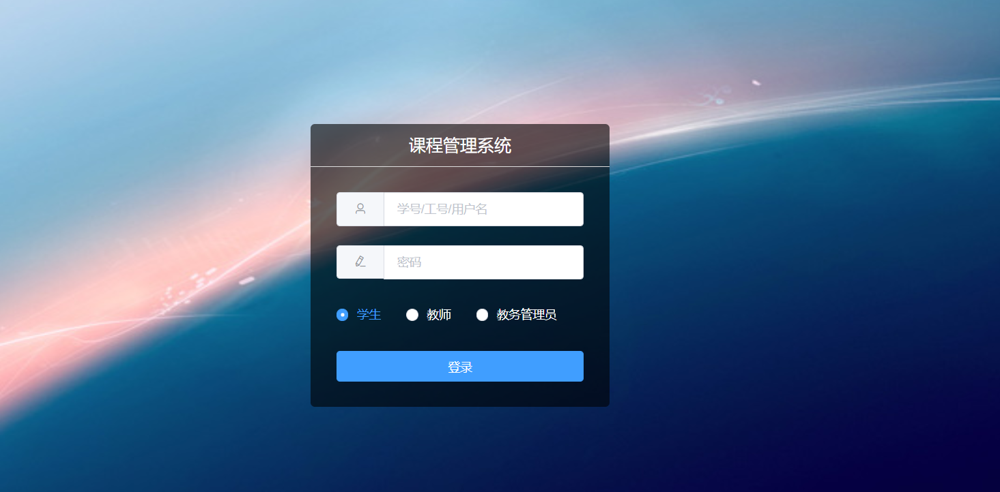
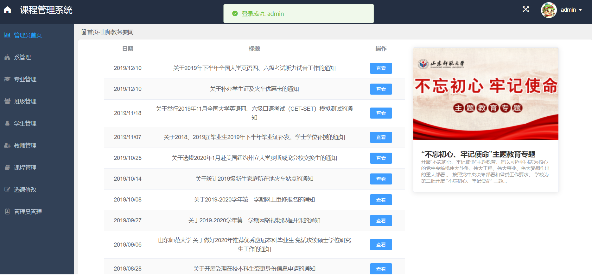
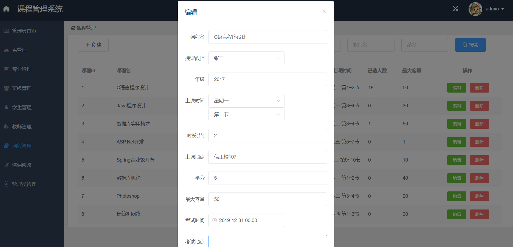
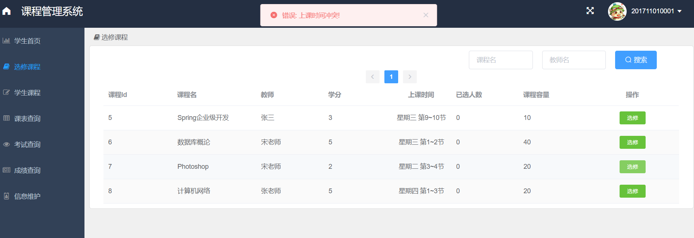
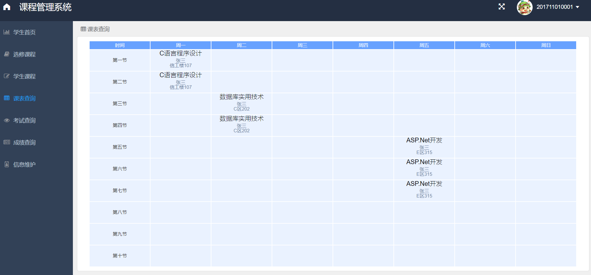
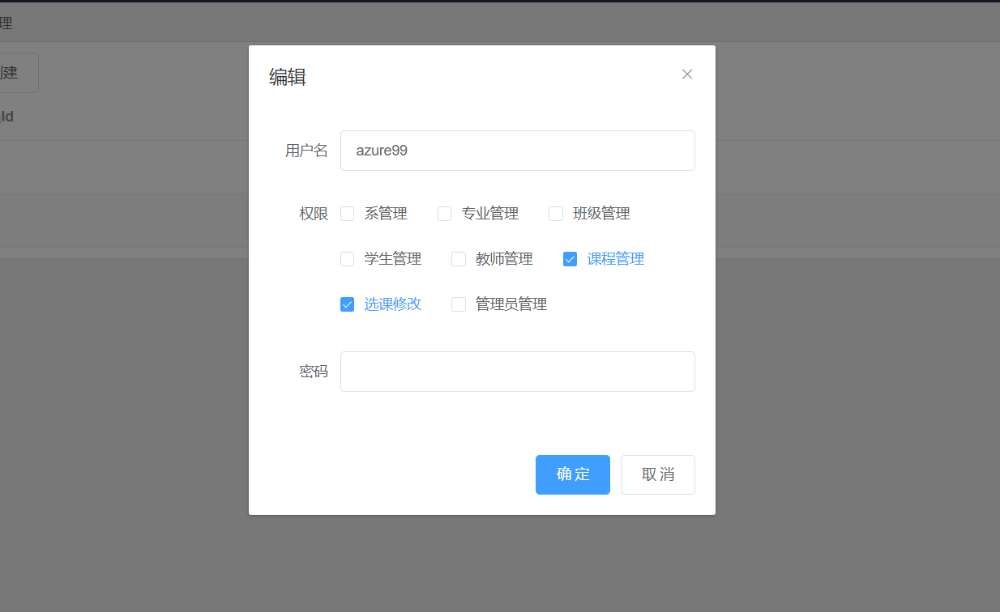
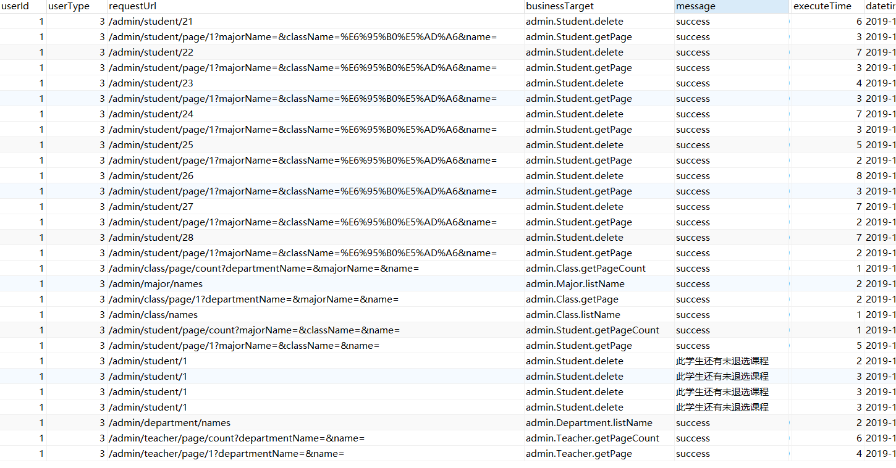

# RainngCourse
数据库大作业，学生选课系统，前后端分离界面美观💎使用流行技术栈Vue ElementUI SpringBoot，Redis实现分布式Session，AOP记录日志由MongoDB存储，可做学习使用

## 技术栈

### 前端Vue.js

- ElementUI
- axios

### 后端SpringBoot

- 持久层: Mybatis Plus
- 授权认证: 手写
- 会话: Spring Session + Redis
- 日志: AOP + MongoDB

### 数据库

- MySQL(MariaDB): 核心业务
- Redis: Session、新闻、配置信息
- MongoDB: 业务日志

## 项目截图

